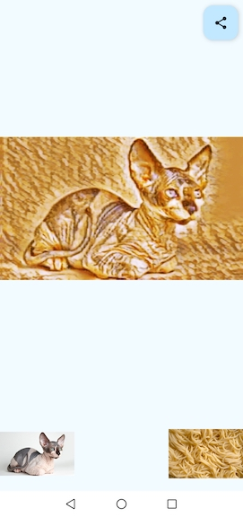

# Android image style transfer

### Features
- pick content and style images
- merge content and style images
- share result image

### Links
- [tensorflow tutorial](https://www.tensorflow.org/tutorials/generative/style_transfer)
- [tensorflow examples](https://github.com/tensorflow/examples/tree/master/lite/examples/style_transfer/android)
- [jetpack compose](https://developer.android.com/develop/ui/compose)

### Screenshot

